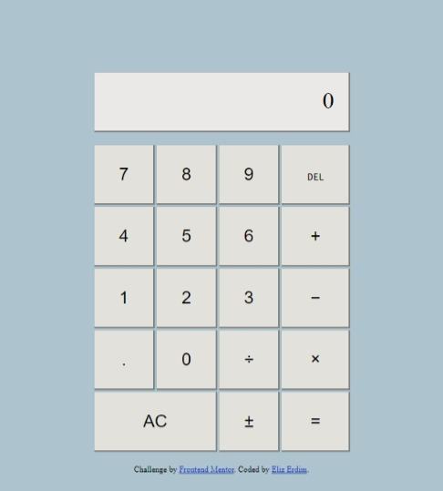

# Calculator App

This is a calculator app coded with vanilla JavaScript.

## Table of contents

- [Overview](#overview)
  - [The challenge](#the-challenge)
  - [Screenshot](#screenshot)
  - [Links](#links)
- [My process](#my-process)
  - [Built with](#built-with)
  - [What I learned](#what-i-learned)
  - [Useful resources](#useful-resources)

## Overview

### The challenge

Users should be able to:

- Perform mathematical operations like addition, subtraction, multiplication, and division

### Screenshot



### Links

- [View Code](https://github.com/elizerdim/calculator)
- [Live Preview](https://elizerdim.github.io/calculator/)

## My process

### Built with

- HTML
- CSS
- JavaScript

### What I learned

This was a real algorithm challenge! I know there are tons of JavaScript calculator tutorials out there that I could've just copied from, but I really wanted to do this by myself. I underestimated this project at first thinking that calculators are pretty straightforward, but it got out of hand at one point so I used pseudocode to gain back control. Here is what I learned working on this project:

- Event propagation and event delegation - capturing and bubbling
- ```closest()``` method is useful when event bubbling is used - it traverses the element and then its parents (heading toward the document root) until it finds a node that matches the specified CSS selector.
```js
e.target.closest('button')
```
- ```contains()``` method can be used on a DOMTokenList (which is what's returned from element.classList) similar to ```includes()``` method (which doesn't work on nodelists) on arrays and strings
- Using a parent element for ```querySelector()``` instead of ```document``` improves performance.
```
const calculatorUI = document.querySelector('.calculator');
const display = calculatorUI.querySelector('.display');
```

### Useful resources

- [innerHTML vs. innerText vs. textContent](https://www.freecodecamp.org/news/innerhtml-vs-innertext-vs-textcontent/#:~:text=Whiles%20innerText%20reads%20text%20as,doesn%27t%20account%20for%20styles.)
- [HTML DOM Elements - Properties and Methods](https://www.w3schools.com/jsref/dom_obj_all.asp)